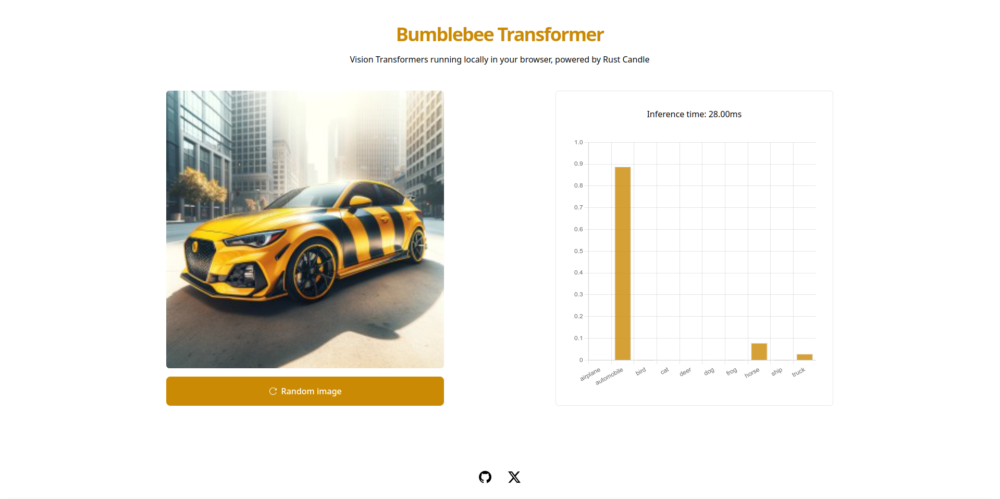

# Bumblebee


[](https://opensource.org/licenses/MIT)

Bumblebee is a small vision transformer that runs locally in the browser with WASM, implemented in Rust using [Candle ML](https://github.com/huggingface/candle) framework.



Bumblebee achieves 56.11% accuracy on the CIFAR-10 dataset. Training took 40 epochs on an RTX 4090 GPU.

### Usage

To train the model:

```bash
cargo bin --run train
```

To compile into WASM and serve:

```bash
./build.sh
python -m http.server -d site/dist
```

**Note**: copy the `weights.safetensors` file into `site/public` after training finishes.

### Todo

- [ ] train on better gpu
- [ ] add wasm-pack-plugin to webpack config, move crate into site
- [ ] add dropout to training
- [ ] refactor code, move model/training params to config class
